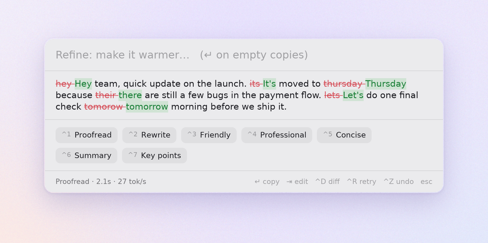

# Quillway

Quillway is a rewrite popup for Wayland that you open with a keyboard shortcut. Copy some text, press the key, then pick a preset or type an instruction. A local model streams the rewrite in as it's generated, and ↵ copies the result.

<p align="center">
  <picture>
    <source media="(prefers-color-scheme: dark)" srcset="assets/screenshot-dark.png">
    
  </picture>
</p>

- **Local only.** A supervised `llama-server` (llama.cpp) runs small writing models that Quillway downloads and verifies. You can also point it at any OpenAI-compatible endpoint, such as Ollama or LM Studio.
- **Any layer-shell compositor.** Tested on niri; Hyprland, Sway, river, KDE and COSMIC should work. GNOME isn't supported because it has no layer-shell.

## Install (Nix + home-manager)

```nix
# flake.nix
inputs.quillway.url = "github:yuxqiu/quillway";
inputs.quillway.inputs.nixpkgs.follows = "nixpkgs";

# home-manager configuration
imports = [ inputs.quillway.homeManagerModules.default ];
services.quillway = {
  enable = true;
  # package = inputs.quillway.packages.${pkgs.system}.quillway-rocm;   # default: Vulkan; ROCm is x86_64 only
  settings = { };                                                     # see "Configuration"
};
```

This installs `quillway` and starts `quillway daemon` as a systemd user service (`quillway.service`) with your graphical session. Then download a model:

```sh
quillway models install qwen3.5-4b   # the default model, Qwen3.5 4B (2.7 GB)
```

Or open the popup and press ↵ on the install card.

Without home-manager: `nix profile install github:yuxqiu/quillway`, then run `quillway daemon` from your compositor's autostart.

### Without Nix

Download `quillway-<version>-<arch>-linux.tar.gz` from [Releases](https://github.com/yuxqiu/quillway/releases) (x86_64 and aarch64; glibc 2.35 or newer), check it against its `.sha256`, and put `quillway` on your `PATH`. It needs a Wayland session (it loads libwayland, libxkbcommon and your Vulkan or GL driver at runtime) and `llama-server` from [llama.cpp](https://github.com/ggml-org/llama.cpp) on your `PATH`, or `model.llama_server` / `model.endpoint` set. Run `quillway daemon` from your compositor's autostart.

### Bind a key

Quillway doesn't grab keys itself. Your compositor runs `quillway toggle`:

```kdl
// niri
binds { Mod+Space { spawn "quillway" "toggle"; } }
```

```ini
# Hyprland
bind = SUPER, space, exec, quillway toggle
# Sway
bindsym Mod4+space exec quillway toggle
```

## Using it

| Where | Key | Action |
|---|---|---|
| Compose | type, then ↵ | Run a custom instruction ("make it sound less formal") |
| | Ctrl+1–9 or click a chip | Run a preset |
| | Tab | Move between the instruction and the text box |
| Writing | Esc | Stop |
| Review | ↵ (empty box) | **Copy** the result and close |
| | type, then ↵ | Refine the current draft ("warmer", "shorter") |
| | Ctrl+1–9 | Run another preset on the current draft |
| | Tab | Move between the instruction and the result, to edit the result yourself |
| | Ctrl+D | Toggle the word diff against the original (off while editing); the choice holds for later drafts |
| | Ctrl+R | Retry (the same request again) |
| | Ctrl+Z | Undo the last draft |
| Anywhere | Esc | Close |

The Ctrl shortcuts above work from the instruction box only; in a text box, Ctrl+C/X/V/A select and copy as usual. They follow the key's position, so they also work on non-Latin layouts.

**Where the text comes from:**
- If you copied something in the last minute (`behavior.recent_secs`), the popup starts with it, and you can still edit it.
- Otherwise the text box opens empty, ready for you to type or paste.
- Quillway notices when you copy without reading the clipboard; it reads the text only when you open the popup, or once when you run `quillway doctor` to check that the clipboard is readable.
- An app can also send the text directly, without the clipboard:

```sh
quillway toggle --stdin                # text on stdin
```

## Models

```sh
quillway models list               # ★ active  ✓ installed
quillway models install gemma-4-e4b
quillway models use gemma-4-e4b    # restarts the model server in the running daemon
quillway models remove qwen3.5-2b
```

| id | Size | Gen speed* | Notes |
|---|---|---|---|
| `qwen3.5-2b` | 1.3 GB | 59 tok/s | Fast; over-edits a little when proofreading |
| `lfm2.5-1.2b` | 0.7 GB | 106 tok/s | Fastest. LFM Open License (not OSI; asks before installing). Weak against prompt injection |
| **`qwen3.5-4b`** (default) | 2.7 GB | 29 tok/s | Best balance; makes minimal edits when proofreading |
| `gemma-4-e4b` | 5.0 GB | 28 tok/s | Writing-oriented prose |
| `qwen3.5-9b` | 5.7 GB | — | For a stronger GPU |

\*Measured on an Intel iGPU with Vulkan. Each entry is pinned to a Hugging Face commit and its sha256 is verified. Downloads resume if interrupted. Models are stored in `$XDG_DATA_HOME/quillway/models`.

Other options:
- **Your own GGUF:** `quillway models use custom:/path/to/model.gguf`.
- **A running server:** set `model.endpoint` (below) to skip the built-in llama-server.

## Configuration

`$XDG_CONFIG_HOME/quillway/config.toml`, or `services.quillway.settings`. Every key is optional; unknown keys are rejected. Apply changes with `quillway reload`.

```toml
[model]
# active = "qwen3.5-4b"       # catalog id or "custom:/path.gguf"; pins the model over `models use` (default: its choice, then qwen3.5-4b)
# endpoint = "http://127.0.0.1:11434/v1"   # OpenAI-compatible server instead of the built-in llama-server
# endpoint_model = "qwen3.5:4b"            # required with endpoint
# endpoint_api_key = "…"
# llama_server = "/path/to/llama-server"   # default: from PATH (the Nix package provides it)
gpu_layers = 99               # model layers run on the GPU; 99 = all of them. Lower only if GPU memory runs out (0 = CPU only, much slower)
context = 8192                # the model's working memory in tokens (~¾ word each); must hold your text and the result, ~3,000 words; at least 1024
extra_args = []               # appended to the llama-server command line

[ui]
theme = "dark"                # dark | light
accent = "#7c6cf2"
width = 680                   # 300–4096 px
top_margin = 220              # px from the top of the screen
opacity = 0.94                # 0.2–1.0
client_shadow = true          # false when a compositor rule draws the shadow
# font = "Inter"             # applies after restarting the daemon

[behavior]
recent_secs = 60              # start with the clipboard only if copied this recently; otherwise open empty

# Defining any [[preset]] replaces the built-in seven.
[[preset]]
name = "Proofread"
instruction = "Fix only clear errors in spelling, grammar and punctuation. Do not change wording or style."
temperature = 0.2             # 0–2
show_diff = true
```

## Commands

```text
quillway daemon                       run the daemon (normally the systemd service)
quillway toggle|show [--stdin]
quillway hide | reload | status | quit
quillway models list|install|use|remove
quillway rewrite -p proofread < in    rewrite stdin to stdout, without the popup; uses the daemon's model server if it runs
                                      (-i "instruction" instead of a preset, --stats for timing)
quillway doctor                       check config, Wayland, clipboard, llama-server, model, daemon
```

## Development

```sh
nix develop                 # toolchain, llama-server, wayland libs
cargo test --workspace
cargo run -p quillway -- daemon
nix flake check             # clippy (deny warnings), tests, rustfmt, package build
cargo run --release -p quillway-engine --example eval -- qwen3.5-4b gemma-4-e4b   # compare models
scripts/screenshots.sh      # re-render assets/screenshot-{dark,light}.png in a headless sway
```

The code is split into four crates:

| Crate | Contents |
|---|---|
| `quillway-core` | Pure logic: config, presets, prompts, diff, catalog, IPC types |
| `quillway-engine` | OpenAI SSE client, llama-server supervisor, downloader |
| `quillway-wl` | Clipboard I/O |
| `quillway` | CLI, IPC, iced UI |

## License

Licensed under either of [Apache License, Version 2.0](LICENSE-APACHE) or [MIT license](LICENSE-MIT), at your option.

Unless you explicitly state otherwise, any contribution intentionally submitted for inclusion in Quillway by you, as defined in the Apache-2.0 license, shall be dual-licensed as above, without any additional terms or conditions.
